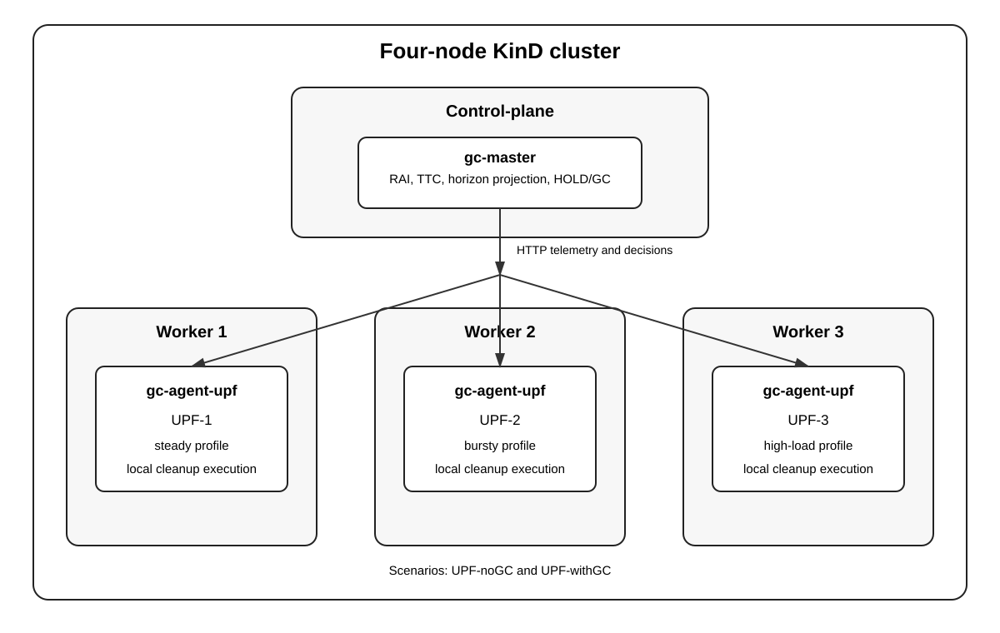

# Residual-Aware Multi-Node Kubernetes Demonstrator

## Purpose

This package accompanies the multi-node validation described in Section VI of the manuscript. It provides a compact, reproducible implementation of the deployment structure, scenario names, and residual-control path in a KinD cluster.

The demonstrator includes:

- one KinD control-plane and three worker nodes;
- one centralized `gc-master` on the control-plane;
- one `gc-agent-upf` pod on each worker;
- three independent UPF residual workload simulators, identified as `UPF-1`, `UPF-2`, and `UPF-3`;
- the two manuscript scenarios, `UPF-noGC` and `UPF-withGC`;
- automated collection and validation of the run evidence.



## Relation to Section VI

The demonstrator retains the Section VI scenario names and reproduces the experimental parameters that are applicable to the compact deterministic implementation.

| Parameter | Value |
|---|---:|
| Monitoring cycles | 240 |
| Cycle duration | 0.05 s |
| Prediction horizon | 5 cycles |
| GC interval | 15 cycles |
| GC reclaim ratio | 75% |
| Residual threshold | 1400 |
| Batch size | 80 |
| Burst interval | 50 cycles |
| Burst duration | 8 cycles |

The complete learned predictor uses a confidence threshold of 0.70. That confidence gate is not evaluated in this package because the demonstrator uses a deterministic horizon-based projection rather than the learned prediction pipeline.

The worker profiles are intentionally heterogeneous:

| UPF | Worker profile |
|---|---|
| `UPF-1` | steady |
| `UPF-2` | bursty |
| `UPF-3` | high-load |

The `UPF-noGC` scenario records residual growth without cleanup. The `UPF-withGC` scenario applies node-local cleanup after a decision from the centralized master.

## Scope

This package is an architectural and functional demonstrator. The complete experimental framework used for the quantitative evaluation reported in the manuscript is maintained separately and is therefore outside the scope of this artifact.

The following simplifications are deliberate:

- residual state is represented by deterministic workload counters rather than live PDR, FAR, or TEID objects;
- each `gc-agent-upf` pod combines the local UPF workload simulator, telemetry reporting, and cleanup execution;
- the master uses a transparent horizon-based projection instead of the complete learned predictor and its confidence gate;
- runtime residual state is maintained locally by each node agent, while shared experiment parameters are supplied through a Kubernetes ConfigMap.

The package preserves the multi-node topology, scenario logic, telemetry exchange, centralized coordination, and per-UPF cleanup path evaluated by the demo. Each scenario is executed with a distinct run identifier. The agent DaemonSet and master Deployment are recreated between scenarios so delayed telemetry from one run cannot enter the next run.

## Limitations

This demonstrator focuses on deployment reproducibility and residual-control orchestration. Consequently, the complete learned prediction pipeline and live core data-plane integration are outside the scope of the artifact, while the execution flow and evaluation scenarios described in Section VI are preserved.

## Project structure

```text
app/                 GC master and node-local agent processes
docs/                architecture figure
k8s/                 Kubernetes manifests and experiment parameters
scripts/             deployment, validation, export, and cleanup
tests/               local policy and package checks
kind-config.yaml      one control-plane and three workers
Dockerfile            container image definition
results/              generated evidence for both scenarios
```

## Requirements

Reference environment:

- Docker 28.x
- KinD 0.29.x
- Kubernetes and kubectl 1.34.x
- Python 3.12 or newer
- curl

The scripts use standard command-line tools available on macOS and Linux.

## Local checks

Run the checks that do not require a Kubernetes cluster:

```bash
chmod +x scripts/*.sh scripts/*.py tests/test_controller.py
./scripts/self_check.sh
```

## Run

From the project directory:

```bash
./scripts/run_demo.sh
```

The script creates the cluster, builds and loads the image, deploys the components, verifies placement, executes both evaluation scenarios, and exports the evidence.

## Inspect the deployment

```bash
kubectl get nodes -o wide
kubectl -n residual-demo get pods -o wide
kubectl -n residual-demo logs deployment/gc-master
kubectl -n residual-demo logs -l app=gc-agent-upf --prefix
```

Controller endpoints:

```bash
kubectl -n residual-demo port-forward svc/gc-master 8080:8080
curl http://127.0.0.1:8080/status
curl http://127.0.0.1:8080/history
curl http://127.0.0.1:8080/metrics
```

## Outputs and validation

The run produces:

```text
results/UPF-noGC/
results/UPF-withGC/
```
Each scenario is executed with an independent run identifier to guarantee scenario isolation and reproducible result collection.

Each directory contains:

- node and pod placement;
- master and agent logs;
- `status.json`;
- `history.json`;
- `history.csv`;
- `metrics.prom`;
- `validation.txt`;
- `run_id.txt`.

Validation requires, for each scenario:

- exactly three worker nodes and three agent pods;
- exactly 240 cycles from each UPF;
- exactly 720 telemetry samples in total;
- one uninterrupted cycle sequence from 1 to 240 for every UPF;
- no GC decisions in `UPF-noGC`;
- at least one 75% GC action for every UPF in `UPF-withGC`;
- valid non-negative RAI and TTC values;
- one scenario and one run identifier across all 720 samples.

A successful run ends with lines similar to:

```text
PASS scenario=UPF-noGC upfs=3 samples=720 hold=720 gc=0
PASS scenario=UPF-withGC upfs=3 samples=720 hold=... gc=...
```

## Cleanup

```bash
./scripts/delete_cluster.sh
```
